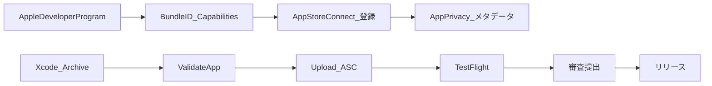

# YellMe（エールミー）— App Store 公開までの手順

このドキュメントは **エールミー** を App Store で配信するまでの実務フローを時系列でまとめたものです。Apple のポリシーや画面 UI は変更されるため、**必ず最新の公式ドキュメントで確認**してください。法的・税務・契約上の判断が必要な場合は専門家に相談してください（本稿は開発・運用のチェックリストであり法的助言ではありません）。

**プロジェクト固有情報（公開時の確認用）**

| 項目 | 値・参照 |
|------|-----------|
| Bundle ID | `com.takahiro.yellme`（[`project.yml`](../../project.yml)） |
| 製品名（バイナリ） | `YellMe` |
| ホーム画面上の表示名 | 「エールミー」（[`Sources/Info.plist`](../../Sources/Info.plist) の `CFBundleDisplayName`） |
| 最低 OS | iOS 17.0 |
| エンタイトルメント | Sign in with Apple（[`YellMe.entitlements`](../../YellMe.entitlements)） |
| 署名チーム | [`project.yml`](../../project.yml) の `DEVELOPMENT_TEAM`（現状空 → Xcode で指定後に反映が必要） |

---

## 全体フロー（俯瞰）

---

## 1. 前提と費用

### 1.1 Apple Developer Program

- **個人**または**組織**として [Apple Developer Program](https://developer.apple.com/programs/) に登録する。
- 登録後、`developer.apple.com`（証明書・Identifiers・Capabilities）と [App Store Connect](https://appstoreconnect.apple.com/)（アプリ情報・審査・TestFlight）の両方が利用可能になる。

### 1.2 アカウントとロール

App Store Connect でよく使うロールの例：

| ロール（概略） | 用途 |
|----------------|------|
| Account Holder | 契約・銀行・税情報など |
| Admin | メンバー管理・ほぼ全操作 |
| Developer | ビルド提出・メタデータ編集など |

チーム開発時は、誰が **証明書／アプリ登録／審査コメント** を担当するか決めておく。

### 1.3 費用

- Apple Developer Program の年会費は **Apple が公式に掲載する金額が正**です。本ドキュメントには具体的な金額を書かず、[公式のプログラム概要](https://developer.apple.com/programs/) で確認してください。

### チェックリスト（章 1）

- [ ] Apple Developer Program に加入済み
- [ ] App Store Connect にログインできる
- [ ] 契約・連絡先・（課金がある場合は）銀行・税情報が App Store Connect で完了している

### よくある詰まり

- **別の Apple ID で Xcode にログインしている** → Team が選べない、アーカイブのアップロードが別アカウントになる。
- **組織アカウントで法人情報の確認が未完** → 一部機能がロックされる。

---

## 2. Apple Developer / Xcode での準備

### 2.1 Bundle ID の登録

1. [Certificates, Identifiers & Profiles](https://developer.apple.com/account/resources/identifiers/list) で **Identifiers > App IDs** を開く。
2. **Bundle ID** が **`com.takahiro.yellme`** と **完全一致**する App ID を作成する（または既存を確認）。
3. YellMe で使う **Capability** を App ID に付与する：
   - **Sign in with Apple**（[`YellMe.entitlements`](../../YellMe.entitlements) と一致させる）

Firebase 利用時は Xcode の「Signing & Capabilities」で追加されることがあるが、**App ID 側と Xcode 側の両方**が整合している必要がある。

### 2.2 署名（Signing）

本リポジトリは XcodeGen を使用しているため、**`.xcodeproj` を手で編集しない**こと（[`CLAUDE.md`](../../CLAUDE.md)）。

1. `xcodegen generate` 後、`YellMe.xcodeproj` を Xcode で開く。
2. Target **YellMe** → **Signing & Capabilities**
   - **Automatically manage signing** をオン（一般的な選択）
   - **Team** に自分の開発チームを選択
3. Xcode が設定した **Team ID** を [`project.yml`](../../project.yml) の `DEVELOPMENT_TEAM` に反映し、再度 `xcodegen generate` する（チームをリポジトリで固定したい場合）。
   - 空のままだと CI や別マシンでアーカイブに失敗しやすい。

### 2.3 Release ビルドとスキーム

- **Scheme**: `YellMe`
- **Configuration**: アーカイブ時は **Release**
- **Deployment Target**: iOS 17.0（[`project.yml`](../../project.yml) と一致）

### チェックリスト（章 2）

- [ ] App ID `com.takahiro.yellme` が Developer サイトに存在する
- [ ] Sign in with Apple が App ID とエンタイトルメントで有効
- [ ] Xcode で Release ビルド・アーカイブがローカルで成功する
- [ ] （任意）`DEVELOPMENT_TEAM` を `project.yml` に記載済み

### よくある詰まり

- **Provisioning profile がない / 期限切れ** → Xcode で「Automatically manage signing」を確認し、Bundle ID を修正。
- **Capability を後から追加したが App ID に未反映** → Developer サイトで App ID を編集し、Xcode で Refresh。

---

## 3. App Store Connect でのアプリ登録

### 3.1 「マイ App」の新規作成

1. [App Store Connect](https://appstoreconnect.apple.com/) → **マイ App** → **+** → **新規 App**
2. **プラットフォーム**: iOS
3. **名前**: App Store に表示される名前（例: 「エールミー」）。他アプリと重なる場合は調整が必要なことがある。
4. **プライマリ言語**: 日本語など
5. **Bundle ID**: ドロップダウンから `com.takahiro.yellme` を選択（事前に Developer で登録済みであること）
6. **SKU**: 一意な内部識別子（例: `yellme-ios-001`）。ユーザーには見えない。

### 3.2 表示名との関係

- App Store の **App 名**（メタデータ）と、デバイス上の **アイコン下の名前**は別概念になり得る。
- ホーム画面の短い名前は [`Sources/Info.plist`](../../Sources/Info.plist) の **`CFBundleDisplayName`**（現在「エールミー」）。長すぎると省略表示される。

### チェックリスト（章 3）

- [ ] App Store Connect にアプリレコードが作成済み
- [ ] Bundle ID が `com.takahiro.yellme` と一致
- [ ] SKU を決めて入力済み

---

## 4. コンプライアンス・プライバシー（審査で重要）

### 4.1 App Privacy（データの収集の申告）

App Store Connect の **App のプライバシー** で、収集するデータの種類・用途・第三者共有などを申告する。

**YellMe で検討が必要になりやすい項目（実装次第で回答が変わる）**

| 区分 | 内容の例 | 備考 |
|------|-----------|------|
| Firebase Auth | アカウント情報、認証関連 | ログイン方式・Firebase の設定による |
| Firestore / Storage | ユーザー生成コンテンツ、ユーザー ID | どのフィールドを書くかで変わる |
| Claude API | ユーザーが入力した日記・選択内容が API に送信される | **クライアント直叩き**か**自前サーバー経由**かで、説明とリスクが変わる |
| Sign in with Apple | Apple が提供する識別子・メールの取り扱い | [Apple のガイドライン](https://developer.apple.com/sign-in-with-apple/get-started/)に沿う |
| 端末ローカル | UserDefaults 等のみでサーバーに送らないデータ | 収集に該当しない場合の申告を公式の定義に照らして判断 |

**注意**: Anthropic API キーをアプリに埋め込む構成は、技術的・コンプライアンス上リスクが高い。**本番ではサーバー側プロキシや独自バックエンド**を検討し、App Privacy とプライバシーポリシーの文言と整合させること。

### 4.2 プライバシーポリシー URL

- 多くのアプリで **公開 URL が実質必須**。ホストするページに、どのデータをなぜ取るかを記載する。
- App Store Connect の該当フィールドに URL を登録する。

### 4.3 輸出規制（暗号化）

- アプリが暗号化を使用する場合、[輸出コンプライアンスに関するAppleのドキュメント](https://developer.apple.com/documentation/security/complying-with-encryption-export-regulations)に沿って回答する。
- 一般的な HTTPS/TLS のみで、かつ該当免除に当てはまる場合は「使用しない／免除」の選択になりやすいが、**最終判断は公式フローと必要に応じて法務**で行う。

Info.plist に **`ITSAppUsesNonExemptEncryption`** を追加するケースがある（値はプロジェクトの実態に合わせる）。

### 4.4 写真・カメラの利用目的キー

[`Sources/Info.plist`](../../Sources/Info.plist) に以下がある：

- `NSCameraUsageDescription`
- `NSPhotoLibraryUsageDescription`

**実際にその機能をリリースビルドで使うか**を確認する。使わないなら実装またはキー削除を検討し、審査時に「未使用の許可キー」と見なされないようにする。

### チェックリスト（章 4）

- [ ] App Privacy を実装に合わせて完了
- [ ] プライバシーポリシーを公開し URL を登録
- [ ] 輸出コンプライアンス質問に回答（必要なら Info.plist を更新）
- [ ] 権限説明文言と実機能が一致

### よくある詰まり

- **第三者 SDK のデータ収集を忘れる** → Firebase / Analytics 等も申告対象になり得る。
- **ログイン必須だがデモアカウント未提供** → 審査でリジェクトされやすい（後述）。

---

## 5. メタデータ・アセット

### 5.1 テキスト情報

- **サブタイトル**、**説明**、**キーワード**（ルールあり）、**サポート URL**
- **マーケティング URL**（任意）
- **バージョン情報**（ユーザー向けリリースノート）

### 5.2 スクリーンショットとプレビュー動画

必須サイズ・枚数は Apple が指定する。**最新は App Store Connect の該当セクションまたは以下を参照**：

- [App Store にアプリを提出する（ヘルプトップ）](https://developer.apple.com/help/app-store-connect/)

### 5.3 年齢区分

質問票に正直に回答する。ユーザ生成コンテンツや AI 応答の内容によって結果が変わる。

### 5.4 AI を利用するアプリについて（確認観点のみ）

本リポジトリは Claude を利用する設計を含む。**App Store レビューガイドライン**（特に機能の説明の正確さ、ユーザデータ、コンテンツの安全性）に沿って説明文・App 内の挙動を確認すること。

- [App Review Guidelines](https://developer.apple.com/app-store/review/guidelines/)

（ガイドラインの解釈は Apple の判断であり、本稿では個別ケースを断定しない。）

### チェックリスト（章 5）

- [ ] 説明文・キーワード・URL 類が入力済み
- [ ] スクリーンショットが必須サイズを満たす
- [ ] 年齢区分の質問に回答済み
- [ ] AI・ログイン・データに関する説明が実態と一致

---

## 6. ビルド・アップロード

### 6.1 バージョンとビルド番号

- **Marketing / Short Version**（ユーザー向けバージョン）: 例 `1.0.0` — [`project.yml`](../../project.yml) の `MARKETING_VERSION` および [`Sources/Info.plist`](../../Sources/Info.plist) と整合
- **Build**（ビルド番号）: アップロードのたびに **単調増加**が必要なことが多い — `CURRENT_PROJECT_VERSION` / `CFBundleVersion`

更新手順の例：

1. [`project.yml`](../../project.yml) で `MARKETING_VERSION` と `CURRENT_PROJECT_VERSION` を更新
2. `xcodegen generate`
3. アーカイブ

### 6.2 アーカイブと検証

1. Xcode でスキーム **YellMe**、実機または Generic iOS Device を選択
2. **Product → Archive**
3. Organizer で **Validate App**（問題を早期発見）
4. **Distribute App** → App Store Connect にアップロード

### 6.3 アップロード後

App Store Connect の **TestFlight** タブで処理が完了するまで待つ（数分〜）。

### チェックリスト（章 6）

- [ ] ビルド番号を前回より大きくした
- [ ] Archive が成功した
- [ ] Validate に重大エラーがない
- [ ] アップロードが完了し TestFlight にビルドが見える

### よくある詰まり

- **Authentication failed / Invalid credentials** → Xcode のアカウント、App Store Connect の権限、2FA を確認。
- **Missing compliance** → 輸出コンプライアンスの質問未回答。
- **Invalid Bundle** → Entitlements / SDK / 最低 OS の不一致。

---

## 7. TestFlight

### 7.1 内部テスト

- 同じ組織のメンバーを **内部テスター**に招待し、ビルドを配布して実機確認する。

### 7.2 外部テスト（ベータ App レビュー）

- 外部ユーザーに配る場合、Apple の **ベータ App レビュー**が必要になることがある。
- **What's New**、連絡先、プライバシーポリシーなどを整える。

### 7.3 YellMe 向け：審査メモ・デモアカウント

Firebase + Sign in with Apple で **ログインしないと使えない**場合：

- App Store Connect の **審査メモ**に、**デモ用 Apple ID は提供できない**旨と代替手段（TestFlight での確認手順、または審査用ビルドでの限定ログイン）を書くのは難しい場合がある。**Apple にレビューしてもらえる具体的な手順**を用意することが重要。
- 一般的には **審査用アカウント**（メール／パスワードログイン等）を用意できる設計が通りやすいが、YellMe のプロダクト方針とトレードオフになる。

### チェックリスト（章 7）

- [ ] 内部テストで主要フロー（記録・エール・オンボーディング・ログイン）を確認
- [ ] （外部テストする場合）ベータ審査に必要な情報を入力
- [ ] クラッシュやネットワークエラー時の挙動を確認

---

## 8. 審査提出とリリース

### 8.1 バージョン情報にビルドを紐付け

App Store Connect で **リリース対象のビルド**を選択し、**審査情報**（ログイン情報、メモ、連絡先）を記入する。

### 8.2 提出前の最終チェックリスト

- [ ] メタデータ・スクリーンショット・年齢区分・プライバシーが最新
- [ ] リリースノート記載
- [ ] 実機で Release に近い構成でリグレッション確認
- [ ] （ログイン必須なら）審査員が進められる案内を審査メモに記載

### 8.3 リリース方法

- **手動リリース**：承認後、自分で「リリース」を実行
- **自動リリース**：承認後すぐ公開
- **段階的リリース**：一定期間かけてユーザに段階的に配信

設定は App Store Connect の **バージョン情報** から行う。

### 8.4 リジェクトされた場合

- App Store Connect の **Resolution Center** のメッセージを読み、指摘に対応してビルドまたはメタデータを修正し、再提出する。

---

## 9. YellMe 向け：実装と整合させるべき項目（サマリー）

| 領域 | 参照ファイル / 設定 | 公開前に確認すること |
|------|---------------------|----------------------|
| Bundle ID | [`project.yml`](../../project.yml)、App Store Connect | `com.takahiro.yellme` の完全一致 |
| 署名 | [`project.yml`](../../project.yml) `DEVELOPMENT_TEAM` | Team 選択・Automatic Signing・CI との整合 |
| Sign in with Apple | [`YellMe.entitlements`](../../YellMe.entitlements)、Developer の App ID | Capability 有効・Firebase と連携テスト |
| Firebase | `Resources/GoogleService-Info.plist`（[`README`](../../README.md)、`.gitignore`） | **本番用プロジェクト**の plist を Release に含める運用 |
| Claude API | [`Sources/Core/Services/ClaudeService.swift`](../../Sources/Core/Services/ClaudeService.swift)、Secrets | キー露出リスク・プライバシー申告・利用規約との整合 |
| 権限キー | [`Sources/Info.plist`](../../Sources/Info.plist) | カメラ／写真の実装との一致 |
| プロジェクト生成 | XcodeGen | `project.yml` 変更後は必ず `xcodegen generate` |

---

## 10. 公式参照リンク集

本ドキュメントは要点のみを記載する。**詳細は以下を参照**すること。

| 内容 | URL |
|------|-----|
| Apple Developer Program | https://developer.apple.com/programs/ |
| App Store Connect | https://appstoreconnect.apple.com/ |
| App Store Connect ヘルプ | https://developer.apple.com/help/app-store-connect/ |
| App Review Guidelines | https://developer.apple.com/app-store/review/guidelines/ |
| Human Interface Guidelines | https://developer.apple.com/design/human-interface-guidelines/ |
| Sign in with Apple | https://developer.apple.com/sign-in-with-apple/ |
| 輸出コンプライアンス（Encryption） | https://developer.apple.com/documentation/security/complying-with-encryption-export-regulations |

---

## リリース後のメモ（任意）

- **クラッシュログ**：Xcode Organizer や第三者ツールで監視する運用を決める。
- **アップデート**：ユーザー向けバージョンとビルド番号のルールをチームで固定する。
- **規約変更**：Apple のガイドライン・契約は更新されるため、年に数回は目を通す。
